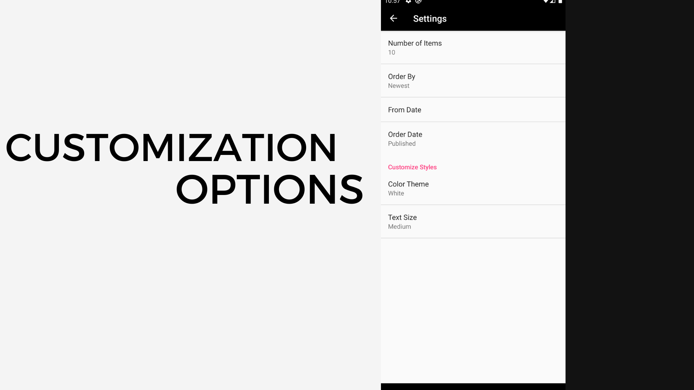

# NewsSurf

Welcome to NewsSurf, an immersive Android application designed to keep you seamlessly connected to the latest news through The Guardian's free API. With its intuitive interface, customizable features, and carefully curated content, NewsSurf ensures an unparalleled news-reading experience.

## Features

### 1. Curated News Feed
- Dive into a world of information with our thoughtfully curated news feed, powered by The Guardian's API. Stay abreast of current events with real-time updates, ensuring that you are always in the know.

### 2. Category Navigation
Effortlessly explore news across a diverse range of categories:

- **Home**: Discover top stories and stay updated with local news.
- **World**: Immerse yourself in global events and international affairs.
- **Science**: Delve into the latest scientific breakthroughs and discoveries.
- **Sport**: Follow your favorite teams and athletes with comprehensive sports coverage.
- **Environment**: Gain insights into environmental issues and sustainability efforts.
- **Society**: Engage with articles covering societal topics and cultural phenomena.
- **Fashion**: Stay on trend with the latest fashion news and style updates.
- **Business**: Get timely updates on economic trends and business developments.
- **Culture**: Explore the world of arts, entertainment, and cultural happenings.
### 3. Customization Options
Tailor your news consumption to your preferences with a suite of customization options:

- **Number of Items**: Personalize your feed by choosing how many news items to display.
- **Order By**: Sort articles based on criteria such as newest, relevance, or popularity.
- **Date Filters**: Focus on specific time periods with customizable date ranges.
- **Styling Options**: Customize the app's appearance with a variety of color themes and text sizes.
## Screenshots

1. News Feed


2. Category Navigation


3. Customization Options




## Installation

Clone the repository:

```bash
  git clone https://github.com/yourusername/newssurf.git
```
    
## Usage

Launch the application, and embark on a journey through different categories, where each swipe brings you closer to a wealth of knowledge. Personalize your experience by adjusting settings to match your preferences.


